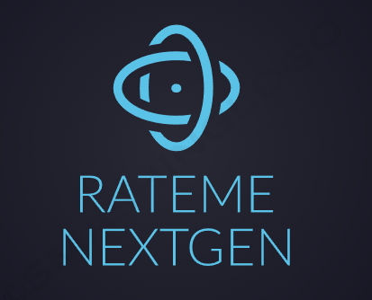

# rateme-nextgen

### Cloud Technologies

### Frontend Technologies

### Backend Technologies

### Monitoring & Tools

Discover great restaurants with ease! Use our map 🗺️ to find amazing places, see what others think with star ratings ⭐, and share your own reviews hassle-free. Sign up quickly and start rating your favorite spots right away 🚀. Add photos to your reviews 📸 and manage them easily. This project involves migrating an existing application to the cloud ☁️ 

## Instances

Running Instances are available:

- Dev: [https://dev.rateme-nextgen.com](https://dev.rateme-nextgen.com)
- Prod: [https://prod.rateme-nextgen.com](https://prod.rateme-nextgen.com)
- Monitoring dashboards [https://monitoring.rateme-nextgen.com](https://monitoring.rateme-nextgen.com)
- Swagger Dev:[https://dev.rateme-nextgen.com/swagger-ui/index.html](https://dev.rateme-nextgen.com/swagger-ui/index.html)
- Swagger Prod:[https://prod.rateme-nextgen.com/swagger-ui/index.html](https://prod.rateme-nextgen.com/swagger-ui/index.html)

## Installation

The Installation and development process is documented in [INSTALLATION.md](./docs/INSTALLATION.md)

## Observability

Take a look at the dashboard [http://monitoring.rateme-nextgen.com](http://monitoring.rateme-nextgen.com)

## Sonarqube

We are hosting an instance running on k8s: [http://sonar.rateme-nextgen.com](http://sonar.rateme-nextgen.com)

Repository: [https://github.com/GoldJns/rateme-nextgen-sonarqube](https://github.com/GoldJns/rateme-nextgen-sonarqube)

To ensure code quality and reduce code smells, we setup quality gates that will lead to a failed  pipeline and prevent deployment

## Services

The backend consists of 3 services:

`Poi Service`: The Poi Service manages locations of the restaurants.

`User Service`: The User Service handles user-related operations, including authentication, user profiles, and access control within the platform.

`Rating Service`: The Rating Service focuses on managing and storing ratings and reviews provided by users for different points of interest or establishments.

## Changelog/Releasenotes

The Release notes are pusblished as artifacts of a github release.
Take a look here: [Releasenotes](https://github.com/GoldJns/rateme-nextgen/releases)

=> [Changelog](/CHANGELOG.md)

## CI/CD

### Terraform Workflows
- `Terraform create` to provision cluster and nodes
- `Terraform destroy` to delete cluster and nodes

### Build-push-image Workflow
We use Github Actions to build the projects/dockerfiles and pusht them to the Github Container Registry.
Currently there are 3 published containers:
- `rateme-nextgen-ui`
- `rateme-nextgen-backend`
- `rateme-nextgen-database`

### Deployment Workflows
We are deploying the changes via helm.
- helm-deployment workflow 
This workflow is templated and is called for each environment

### Github environments

We use Github environments to store environment specific data in objects like variables/environment secrets
e.g. the name of the namespace or the db secret.

## IaC

We use terraform to provision our cloud ressources(e.g. gke cluster). Terraform files are located in "./terraform" folder.

## Credits
This project includes code adapted from [rateme](https://github.com/alex9849/rateme) by [alex9849](https://github.com/alex9849). 

Thanks to the prometheus communuity for providing helpful helmcharts [kube-prometheus-stack](https://github.com/prometheus-community/helm-charts/tree/main/charts/kube-prometheus-stack ).

When it comes to terraform and gke we can recommand this guide which helped us a lot: [https://dev.to/admantium/google-kubernetes-engine-mostly-automated-installation-with-terraform-47dg](https://dev.to/admantium/google-kubernetes-engine-mostly-automated-installation-with-terraform-47dg) 

This guide is also very good:[cert-manager-gke-guide](https://cert-manager.io/docs/tutorials/getting-started-with-cert-manager-on-google-kubernetes-engine-using-lets-encrypt-for-ingress-ssl/#7-create-an-issuer-for-lets-encrypt-staging)