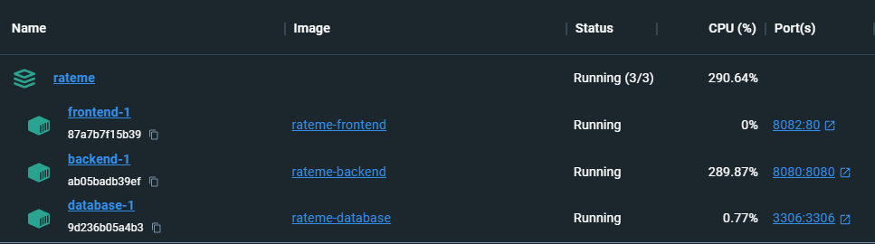

# Installationguide

## Table of Contents
- [Prerequisites](##prerequisites)
- [Development](#development)
- [Swagger](#swagger)
- [Services](#services)
- [Helm](#helm)
- [Deployment](#deployment)
- [Secrets](#secrets)

## Prerequisites

Before starting with this project, ensure you have the following software installed and properly configured:

**Docker**
  - **Installation**: Docker allows you to package, distribute, and run applications in containers.
  - **Operating System**: Compatible with Windows, macOS, and various Linux distributions.
  - [Docker Installation Guide](https://docs.docker.com/get-docker/): Follow the guide specific to your operating system for Docker installation.

**Docker Compose**
  - **Purpose**: Docker Compose is a tool for defining and running multi-container Docker applications.
  - **Included**: Often included in Docker Desktop for Windows and macOS.
  - [Docker Compose Installation Guide](https://docs.docker.com/compose/install/): Follow the guide to install Docker Compose if not included in your Docker installation.

**kubectl**
  - **Purpose**: `kubectl` is a command-line tool for interacting with Kubernetes clusters.
  - [kubectl Installation Guide](https://kubernetes.io/docs/tasks/tools/install-kubectl/): Follow the guide specific to your operating system for `kubectl` installation.

**Java Development Kit (JDK)**
  - **Purpose**: Java Development Kit is required for running Java applications.
  - [Oracle JDK](https://www.oracle.com/java/technologies/javase-jdk11-downloads.html) or [OpenJDK](https://adoptopenjdk.net/): Download and install the JDK appropriate for your operating system.

**Maven**
  - No further need to install Maven. We suggest using the Maven Wrapper defined in the project root.

**Verify Installation**

After installation, ensure Docker, Docker Compose, Java, and `kubectl` are properly installed by checking their versions using the following commands:
  - Docker: `docker --version`
  - Docker Compose: `docker-compose --version`
  - Java: `java -version`
  - kubectl: `kubectl version --client`
    


## Development

### Build

Run `./mvnw clean package` to build the project.

### Run

Ensure you have rights to execute run script e.g with linux
```sh
  sudo chown +x run.sh   
```

This commmand will run the two docker-compose projects(Main Project and Monitoring project)
```sh
  ./run.sh
```

In development or testing it makes sense to start project manually with docker compose. 
Just run 

```sh
  docker compose up --build
```
to rebuild containers after changes.

Alternatively you can start services like db and frontend with docker compose
```sh
  docker compose up database frontend --build
```
and start springboot manually via terminal or vs code extension.

Make sure to run `./mvnw clean package` from time to time


### Pulling Docker Images from GitHub Container Registry (ghcr.io)

The ui, backend and database images are build and pushed in a github actions workflow. The Images are stored in the github container registry. You can see more information when clicking on the published packages in the repo

### 1. Authenticate with GitHub Container Registry
Before pulling images, you need to authenticate with GitHub Container Registry using the GitHub Personal Access Token (PAT).

```bash
docker login ghcr.io -u YOUR_GITHUB_USERNAME
# Enter your GitHub Personal Access Token (PAT) as the password when prompted
```

Replace `YOUR_GITHUB_USERNAME` with your GitHub username. Use a GitHub Personal Access Token as the password when prompted.

### 2. Pull Docker Image
Use the following command to pull an image from `ghcr.io/goldjns`:

```bash
docker pull ghcr.io/goldjns/IMAGE_NAME:TAG
```

Replace `IMAGE_NAME` with the name of the Docker image you want to pull and `TAG` with the specific version or tag of the image. For example:

```bash
docker pull ghcr.io/goldjns/my-rateme-nextgen-ui:latest
```

Replace `latest` with the specific tag/version of the image you want to pull.

### 3. Use the Pulled Image
Once the image is pulled successfully, you can use it to run containers on your local machine or deploy it to your environment using the `docker run` command.

```bash
docker run -d -p 8080:80 ghcr.io/goldjns/rateme-nextgen-ui:latest
```

This command will run a container named `rateme-nextgen-ui` based on the pulled image `ghcr.io/goldjns/rateme-nextgen-ui:latest`, forwarding port `8080` on your local machine to port `80` inside the container.

Adjust the image names, tags, and run configurations based on your specific requirements and application setup.

## Swagger

Open Api Definition of our services. Hosted on `http://localhost:8080/swagger-ui/index.html`

## Services 

Following services will start:

- Frontend 🌐 on port `8082`
- Prometheus 📈 on port `9090`
- Grafana 📊 on port `3000`
- Node Exporter 🖥️ on port `9100`
- Spring Boot App 🚀 on port `8080`
- Loki 🌀 on port `3100`





## Helm

k8 deployment is done via helm-charts. All relevant files are located in `./helm` folder.

The `deployAll` script will install/upgrade the helm charts. You can configure the script(toggle between install/upgrade) or you can add additional release names. In default mode the ui, backend and database charts will be deployed in pipeline. Ressources that dont change often(externalsecrets, srtviceaccounts, secretstores, ingress, etc) can be deployed manually if necessary. Pass the environemnt/namespace as argument to that script. If no argument is passed, default namespace will be used. frontend, backend and ui charts are encapsulated with the parent chart. 

```sh
helm install parent ./parent .  # will deploy all charts
```


```sh
  ./deployAll.sh [dev | prod]
```

## Secrets

Secrets are handled via [external-secrets-plugin](https://github.com/external-secrets/kubernetes-external-secrets). The secrets are stored in gke Secret Manager and can be accessed via service-account.


1. Ensure Workload Identity is enabled

2. Setup workload identity


```sh
#Create GCP service account
gcloud iam service-accounts create gke-prod-service-account \
--project=rateme-nextgen

#Create IAM role bindings
gcloud projects add-iam-policy-binding rateme-nextgen --member "serviceAccount:gke-prod-service-account@rateme-nextgen.iam.gserviceaccount.com" --role "roles/secretmanager.secretAccessor"

```
1. Create k8s service account

```sh
  kubectl create serviceaccount prod-service-account --namespace prod
```

2. Allow kubernetes service account to impersonate GCP service account

```sh
gcloud iam service-accounts add-iam-policy-binding gke-prod-service-account@rateme-nextgen.iam.gserviceaccount.com  --role roles/iam.workloadIdentityUser --member "serviceAccount:rateme-nextgen.svc.id.goog[prod/prod-service-account]"
```


3. Add annotations

```sh
kubectl annotate serviceaccount prod-service-account --namespace prod iam.gke.io/gcp-service-account=gke-prod-service-account@rateme-nextgen.iam.gserviceaccount.com
```

4. Inject secrets via secretstore and externalsecret:

```sh
kubectl apply -f secretstore.yaml
kubectl apply -f secrets.yaml
```

## Deployment 

### Checklist 🛠️

Before deploying, ensure everything is ready.

- Provision Infrastructure (Run respective Terraform workflows)

- Dev and prod namespaces are available

- Service account for each namespace are available(dev-service-account etc.)  

- Setup Secret Store and Secrets: 🔒

- Install required Helm plugins (e.g., external-secrets-plugin) 

- Manually deploy changes related to ingress and secrets with kubectl 

Taking care of these steps will help ensure a successful deployment!

## Observability

Observability is done with grafana loki and node exporter. Installation via helm.

### Grafana

1. Setup grafana
```sh
  helm install grafana grafana/grafana --namespace grafana --create-namespace
```

2. Login with admin user

```sh
  kubectl get secret grafana -n grafana -o jsonpath="{.data.admin-password}" | base64 --decode ; echo
```

3. Add datasources like prometheus and loki.

4. Add dashboards (e.g. via id 15141 )


### Loki and Promtail

Navigate to `monitoring/loki`

Execute helm commands:

```sh
helm upgrade --install --values loki-distributed-overrides.yaml loki grafana/loki-distributed -n grafana-loki --create-namespace
```

At the moment dashboards are not persisted => reinstall after pod crashes.


